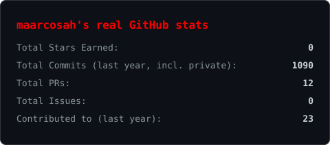

<div align="center">

```
███╗   ███╗ █████╗ ██████╗  ██████╗ ██╗   ██╗███████╗████████╗███████╗
████╗ ████║██╔══██╗██╔══██╗██╔═══██╗██║   ██║██╔════╝╚══██╔══╝██╔════╝
██╔████╔██║███████║██████╔╝██║   ██║██║   ██║█████╗     ██║   ███████╗
██║╚██╔╝██║██╔══██║██╔══██╗██║▄▄ ██║██║   ██║██╔══╝     ██║   ╚════██║
██║ ╚═╝ ██║██║  ██║██║  ██║╚██████╔╝╚██████╔╝███████╗   ██║   ███████║
╚═╝     ╚═╝╚═╝  ╚═╝╚═╝  ╚═╝ ╚══▀▀═╝  ╚═════╝ ╚══════╝   ╚═╝   ╚══════╝
```

<picture>
  <source media="(prefers-color-scheme: dark)" srcset="assets/avatar-dots-dark.svg">
  <source media="(prefers-color-scheme: light)" srcset="assets/avatar-dots-light.svg">
  
</picture>

[](https://git.io/typing-svg)


</div>

<br>

---

## 💻 Tech Stack

<table>
<tr>
<td valign="top"><b>Lenguajes</b></td>
<td>


</td>
</tr>
<tr>
<td valign="top"><b>Frontend</b></td>
<td>


<br>


</td>
</tr>
<tr>
<td valign="top"><b>Backend</b></td>
<td>


<br>


</td>
</tr>
<tr>
<td valign="top"><b>Bases de datos</b></td>
<td>


<br>


</td>
</tr>
<tr>
<td valign="top"><b>Diseño y multimedia</b></td>
<td>


<br>


</td>
</tr>
<tr>
<td valign="top"><b>Herramientas y DevOps</b></td>
<td>


<br>


</td>
</tr>
</table>

<br>

---

## 📊 GitHub Stats

<div align="center">

<picture>
  <source media="(prefers-color-scheme: dark)" srcset="https://raw.githubusercontent.com/maarcosah/maarcosah/output/snake-dark.svg">
  <source media="(prefers-color-scheme: light)" srcset="https://raw.githubusercontent.com/maarcosah/maarcosah/output/snake.svg">
  
</picture>

<picture>
  <source media="(prefers-color-scheme: dark)" srcset="assets/stats-dark.svg">
  <source media="(prefers-color-scheme: light)" srcset="assets/stats-light.svg">
  
</picture>


</div>

<br>

<!-- Proudly created with GPRM ( https://gprm.itsvg.in ) -->
