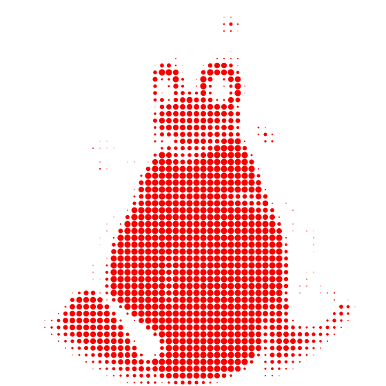

<div align="center">

<picture>
  <source media="(prefers-color-scheme: dark)" srcset="assets/avatar-dots-dark.svg">
  <source media="(prefers-color-scheme: light)" srcset="assets/avatar-dots-light.svg">
  
</picture>

```
███╗   ███╗ █████╗ ██████╗  ██████╗ ██╗   ██╗███████╗████████╗███████╗
████╗ ████║██╔══██╗██╔══██╗██╔═══██╗██║   ██║██╔════╝╚══██╔══╝██╔════╝
██╔████╔██║███████║██████╔╝██║   ██║██║   ██║█████╗     ██║   ███████╗
██║╚██╔╝██║██╔══██║██╔══██╗██║▄▄ ██║██║   ██║██╔══╝     ██║   ╚════██║
██║ ╚═╝ ██║██║  ██║██║  ██║╚██████╔╝╚██████╔╝███████╗   ██║   ███████║
╚═╝     ╚═╝╚═╝  ╚═╝╚═╝  ╚═╝ ╚══▀▀═╝  ╚═════╝ ╚══════╝   ╚═╝   ╚══════╝
```

[](https://git.io/typing-svg)

</div>

<br>

---

## 💻 Tech Stack

**Lenguajes**


**Frontend**


**Backend**


**Bases de datos**


**Diseño y multimedia**


**Herramientas y DevOps**


<br>

---

## 📊 GitHub Stats

<div align="center">

<picture>
  <source media="(prefers-color-scheme: dark)" srcset="https://raw.githubusercontent.com/maarcosah/maarcosah/output/snake-dark.svg">
  <source media="(prefers-color-scheme: light)" srcset="https://raw.githubusercontent.com/maarcosah/maarcosah/output/snake.svg">
  
</picture>


</div>

<br>

<!-- Proudly created with GPRM ( https://gprm.itsvg.in ) -->
